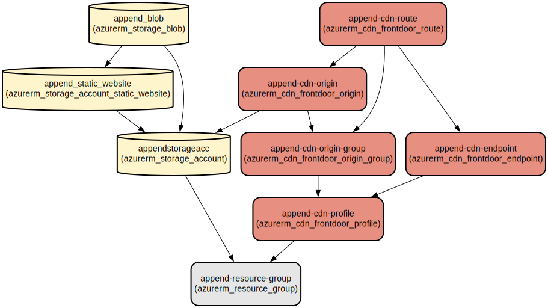

# Append - A Modern Website Template with Azure Infrastructure

Append is a professional Bootstrap website template with automated Azure infrastructure deployment, providing a seamless solution for creating responsive websites with enterprise-grade hosting and content delivery.

The template combines a modern, responsive Bootstrap-based frontend with infrastructure-as-code using Terraform for Azure deployment. It features a comprehensive set of pre-built pages including blog, portfolio, and services sections, along with dynamic components like carousels, animations, and filtering systems. The infrastructure setup automatically provisions Azure Storage for hosting and Azure Front Door for global content delivery.

## Repository Structure
```
.
├── src/                              # Frontend source code
│   ├── assets/                       # Static assets (CSS, JS, vendor libraries)
│   │   ├── css/                     # Custom CSS styles
│   │   ├── js/                      # Custom JavaScript functionality
│   │   ├── scss/                    # SCSS source files (Pro version only)
│   │   └── vendor/                  # Third-party libraries (Bootstrap, AOS, etc.)
│   ├── forms/                       # Contact form handling
│   ├── *.html                       # HTML template pages
├── terraform/                        # Infrastructure as Code
│   ├── main.tf                      # Main Azure infrastructure configuration
│   ├── provider.tf                  # Azure provider configuration
│   ├── outputs.tf                   # Infrastructure output variables
│   └── get_mime_type.py            # MIME type detection utility
```

## Usage Instructions
### Prerequisites
- Node.js and npm (for frontend development)
- Python 3.x (for MIME type detection utility)
- Azure CLI
- Terraform >= 0.12
- Azure subscription with required permissions

### Installation

1. Clone the repository:
```bash
git clone <repository-url>
cd append-template
```

2. Install frontend dependencies:
```bash
cd src
npm install
```

3. Configure Azure credentials:
```bash
az login
```

4. Initialize Terraform:
```bash
cd terraform
terraform init
```

### Quick Start

1. Deploy the infrastructure:
```bash
cd terraform
terraform plan
terraform apply
```

2. After deployment, get the Front Door endpoint URL:
```bash
terraform output frontdoor_endpoint_url
```

3. Access your website using the Front Door endpoint URL.

### More Detailed Examples

#### Customizing the Template
```html
<!-- Modify the header in index.html -->
<header id="header" class="header">
  <div class="container-fluid">
    <a href="index.html" class="logo">
      <h1>Your Brand</h1>
      <span>.</span>
    </a>
    <!-- Add your navigation items here -->
  </div>
</header>
```

#### Adding Custom Styles
```css
/* Add to assets/css/main.css */
:root {
  --primary-color: #your-brand-color;
  --secondary-color: #your-secondary-color;
}
```

### Troubleshooting

#### Common Issues

1. Infrastructure Deployment Failures
- Error: "Storage account name already exists"
  - Solution: Modify the storage account name in main.tf
  - Command: `terraform apply -var="storage_account_name=uniquename"`

2. MIME Type Detection Issues
- Error: "Python script execution failed"
  - Check Python installation: `python3 --version`
  - Verify file permissions: `chmod +x get_mime_type.py`

3. Front Door Configuration
- Error: "Origin health probe failed"
  - Verify storage account settings
  - Check index.html exists in the storage container
  - Command: `az storage blob list --container-name '$web'`

## Data Flow
The template implements a static website hosting architecture with global content delivery.

```ascii
[Client] → [Azure Front Door] → [Azure Storage Static Website]
     ↑          |
     └──────────┘
   (Cached Content)
```

Key component interactions:
1. Static files are uploaded to Azure Storage via Terraform
2. Azure Front Door provides global content delivery
3. MIME types are automatically detected for proper content serving
4. Health probes monitor origin availability
5. Caching is configured for optimal performance

## Infrastructure



### Resource Group
- Type: `azurerm_resource_group`
- Name: append-resource-group
- Purpose: Contains all Azure resources

### Storage
- Type: `azurerm_storage_account`
- Name: appendstorageacc
- Purpose: Hosts static website content
- Features: Static website enabled, blob storage

### CDN
- Type: `azurerm_cdn_frontdoor_profile`
- Name: append-cdn-profile
- Purpose: Global content delivery
- Features: 
  - Custom domain support
  - HTTPS
  - Caching
  - Compression

## Deployment

### Prerequisites
- Azure subscription
- Terraform installed
- Azure CLI configured

### Deployment Steps
1. Configure Azure provider:
```bash
az login
az account set --subscription "<subscription_id>"
```

2. Initialize Terraform:
```bash
terraform init
```

3. Deploy infrastructure:
```bash
terraform plan
terraform apply
```

4. Verify deployment:
```bash
terraform output frontdoor_endpoint_url
```
